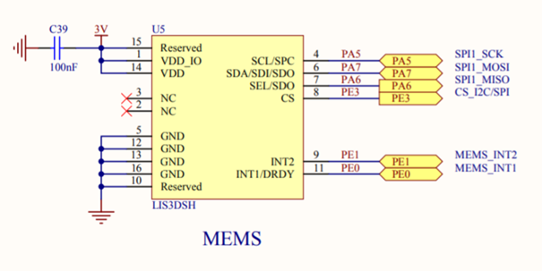
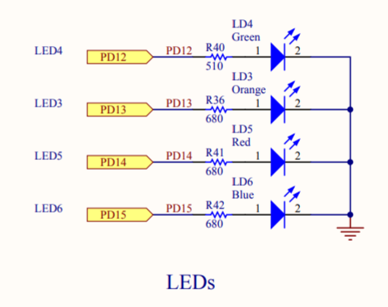
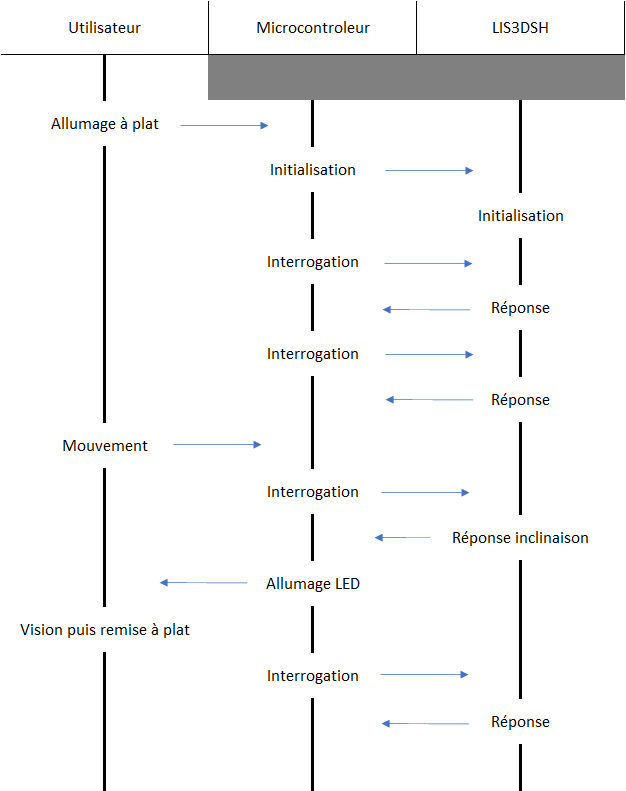
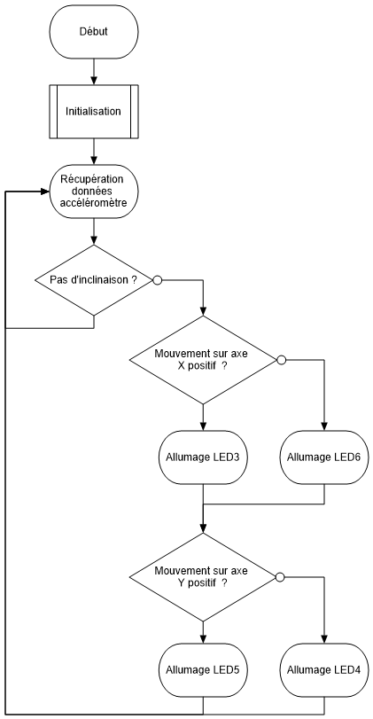

# Driver-LIS3DSH
Ce driver permet d'utiliser l'accéléromètre **LIS3DSH** de **STMicroelectronics**.  
Ce pilote a été conçu à l'aide de **STM32CubeIDE** sur la carte **STM32F407G-DISC1**.

Lien Git : https://github.com/MoiseMoussetafa/Driver-LIS3DSH

## Accéléromètre
C'est un capteur permettant de mesurer l'accélération linéaire de l'objet sur lequel il est fixé, dans les 3 axes de l'espace X, Y et Z.

## Utilisation
Ce driver permet d'allumer les LEDS 3, 4, 5 et 6 en fonction de l'inclinaison de la carte et des paramètres choisis.

L'utilisation de ce driver se fait grâce aux 2 fichiers : `LIS3DSH.h` et `LISH3DSH.c`.

---
## Schémas de câblage
La pin PA5 correspond au signal d'horloge de la SPI entre le microcontroleur et le LIS3DSH.  
La pin PA7 correspond au signal MOSI de la SPI entre le microcontroleur et le LIS3DSH.  
La pin PA6 correspond au signal MISO de la SPI entre le microcontroleur et le LIS3DSH.  
La pin PE3 correspond au signal CS, permettant d'activer ou non la communication SPI entre le microcontroleur et le LIS3DSH.  
Les pins PE1 et PE2 sont spécifiques aux fonctions d'interruption. Elles ne sont pas utilisées sur ce driver.

Les pins PD12, 13, 14 et 15 correspondent à des GPIO du microcontroleur, permettant de controler l'allumage des LEDS correspondantes sur le circuit.

***Câblage du LIS3DSH :***



***Câblage des LEDS :***




## Paramètres
Toutes les informations de paramètrage du LIS3DSH sont disponibles sur https://www.st.com/resource/en/datasheet/lis3dsh.pdf

Pour ce driver, les paramètres modifiables sont :
```
power
- LIS3DSH_ON : Allumer le module
- LIS3DSH_OFF : Eteindre le module

axe
- LIS3DSH_XY : Activer l'accéléromètre sur les axes X et Y
- LIS3DSH_X : Activer l'accéléromètre sur l'axe X uniquement
- LIS3DSH_Y : Activer l'accéléromètre sur l'axe Y uniquement

scale
- LIS3DSH_SCALE_2G
- LIS3DSH_SCALE_4G
- LIS3DSH_SCALE_6G
- LIS3DSH_SCALE_8G
- LIS3DSH_SCALE_16G
```

Ces paramètres peuvent être changés directement dans le `LIS3DSH.c`, dans la fonction `LIS3DSH_Init_t`
```c
/* Init LIS3DSH */
LIS3DSH_Status LIS3DSH_Init_t(SPI_HandleTypeDef *hspi,
		LIS3DSH_Init *posInitDef)
{
	uint8_t spiData[2] = {0x00, 0x00};	//Data to send to LIS3DSH
	uint8_t spiCheckData[2] = {0x00, 0x00};	//Data to read from LISH3DSH

	//Config REG4
	spiData[0] |= (posInitDef->power | LIS3DSH_ON);	//<---
	spiData[0] |= (posInitDef->axe | LIS3DSH_XY);	//<---

	//Config REG5
	spiData[1] |= (posInitDef->scale | LIS3DSH_SCALE_4G);	//<---
  ...
``` 

Les registres utilisés sont :
```
CTRL_REG4
CTRL_REG5
OUT_X_L
OUT_X_H
OUT_Y_L
OUT_Y_H
```

Le LIS3DSH communique avec le microcontroleur via la SPI1. La configuration de la communication est simplifiée grâce à STM32CubeIDE, à l'aide du fichier .ioc.

Dans `Pinout & Configuration`, on sélectionne `SPI1`, puis : 

Dans **Mode** :

- Mode : Full-Duplex Master  
*Le microcontroleur et au LIS3DSH communiquent en même temps. Le microcontroleur est maitre et le LIS3DSH est esclave.*

Dans **Configuration**, **Parameter Settings** :

- Data Size : 8 Bits
- First Bit : MSB First
- Clock Polarity (CPOL) : High
- Clock Phase (CPHA) : 2 Edge

*La taille de la donnée communiquée par la SPI1 est en 8 bits. Le 1e bit de donnée est celui de poids fort.*  
*La polarité du signal d'horloge correspond à son état de repos. Pour ce driver, c'est l'état haut.*  
*La phase du signal d'horloge correspond au front de l'horloge utilisé pour la lecture de la valeur d'un bit sur le signal MISO/MOSI. Pour ce driver, c'est le 2e front.*

*Toutes les autres informations sont laissées dans leurs états par défaut.*

## Architecture logicielle

### Diagramme des intéractions
Ce diagramme présente les intéractions entre l'utilisateur, le microcontroleur et le LIS3DSH, après alimentation du système.



Le microcontroleur et le LIS3DSH se regroupent sur un même objet, en l'occurrence la carte électronique. Ils communiquent constamment entre eux et lorsque l'utilisateur effectue un mouvement de la carte, l'inclinaison est détecté par l'accéléromètre qui retourne une réponse spécifique, provoquant l'allumage des LEDS correspondantes par le microcontroleur.

### Diagramme de flux
Ce diagramme présente schématiquement l'organisation générale du déroulement du driver.



Le driver démarre par une initialisation du système. Les données issues de l'accéléromètre sont ensuite récupérées.  
S'il n'y a pas d'inclinaison détéctées, les LEDS restent éteintes et on analyse les données suivantes.  
Dans le cas contraire, on identifie sur l'inclinaison est positive ou non sur l'axe X et la LED correspondante est allumé, puis de même sur l'axe Y.

---
## Conclusion
ça marchait pas
mais maintenant ça marche
