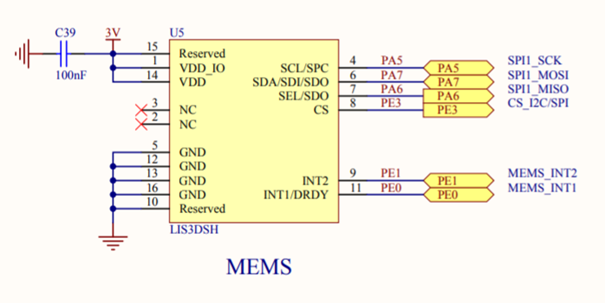
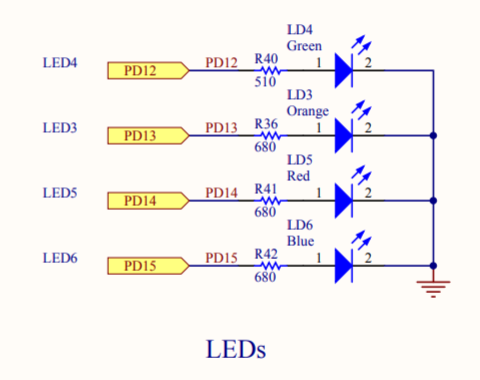
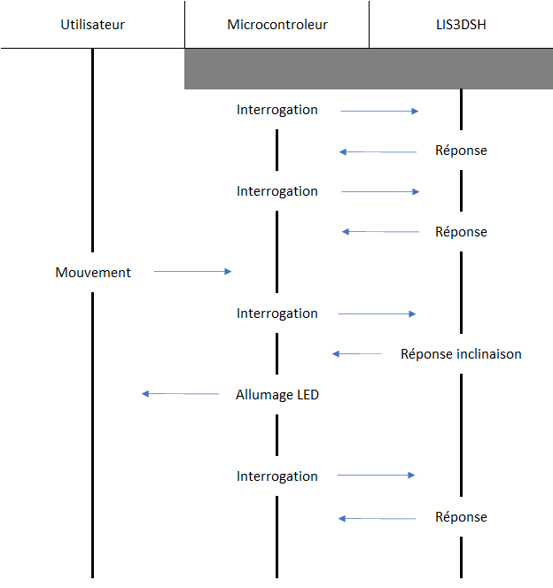

# Driver-LIS3DSH
Ce driver permet d'utiliser l'accéléromètre **LIS3DSH** de **STMicroelectronics**.

Ce driver a été conçu à l'aide de **STM32CubeIDE1.5.0** sur la carte **STM32F407G-DISC1**.

## Accéléromètre
C'est un capteur permettant de mesurer l'accélération linéaire de l'objet sur lequel il est fixé, dans les 3 axes de l'espace X, Y et Z.

## Utilisation
Ce driver permet d'allumer les LEDS 3, 4, 5 et 6 en fonction de l'inclinaison de la carte et des paramètres choisis.

L'utilisation de ce driver se fait grâce aux 2 fichiers : `LIS3DSH.h` et `LISH3DSH.c`.

## Schémas de câblage
Les pins des ports A, D et E correspondent aux pins utilisés sur le microcontroleur.

***Câblage du LIS3DSH :***



***Câblage des LEDS :***




## Paramètres
Toutes les informations de paramètrage du LIS3DSH sont disponibles sur https://www.st.com/resource/en/datasheet/lis3dsh.pdf

Pour ce driver, les paramètres modifiables sont :
```
power
- ON
- OFF

axe
- X et Y
- X uniquement
- Y uniquement

scale
- 2G
- 4G
- 6G
- 8G
- 16G
```

Le LIS3DSH communique avec le microcontroleur via la SPI1.
Les registres utilisés sont :
```
CTRL_REG4
CTRL_REG5
OUT_X_L
OUT_X_H
OUT_Y_L
OUT_Y_H
```

## Architecture logicielle

### Diagramme des intéractions
Ce diagramme présente les intéractions entre l'utilisateur, le microcontroleur et le LIS3DSH.




Ces 2 derniers se regroupent sur un même objet, en l'occurrence une carte électronique. Ils communiquent constamment entre eux et lorsque l'utilisateur effectue un mouvement de la carte, l'inclinaison est détecté par l'accéléromètre qui retourne une réponse spécifique, provoquant l'allumage des LEDS correspondantes par le microcontroleur.
